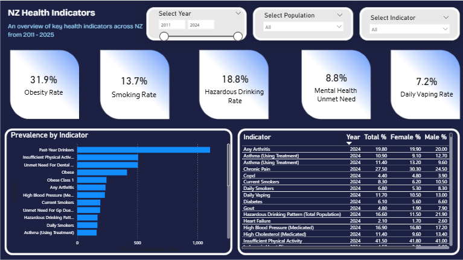
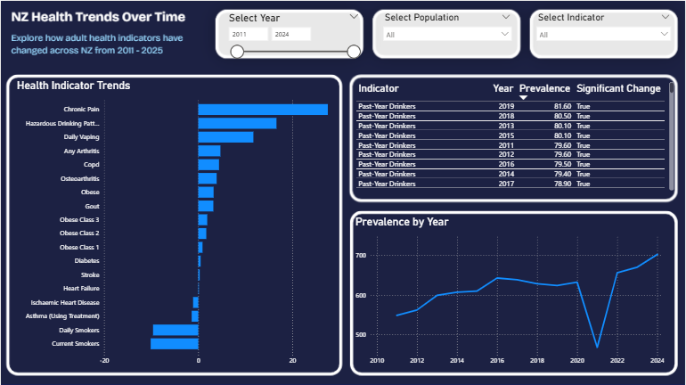
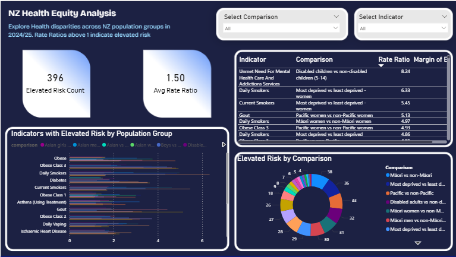
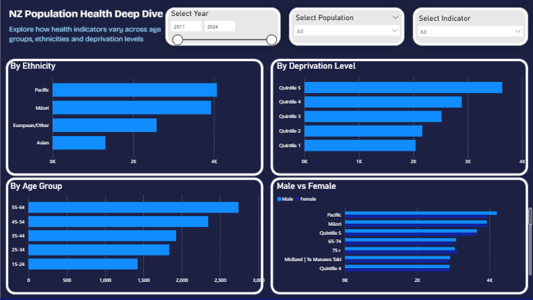

# NZ Health Survey Analysis — End-to-End Data Pipeline & Power BI Dashboard

An end-to-end data analytics project analysing 14 years of New Zealand population 
health data from the Ministry of Health NZ Health Survey (2011–2025). The project 
demonstrates a complete analyst workflow: raw data ingestion, Python cleaning pipeline, 
Power BI data modelling, and a four-page interactive dashboard.

---

## Key Findings

- The most deprived vs least deprived women show a daily smoking rate ratio of **6.33** 
  — the starkest equity gap in the dataset
- **Quintile 5 (most deprived)** consistently shows the highest prevalence across all 
  risk indicators including obesity, smoking, and hazardous drinking
- **Pacific populations** show the highest obesity prevalence by ethnicity; 
  **Māori** show the highest daily smoking rates — consistent with longstanding 
  health equity research in NZ

---

## Dashboard Preview






---

## Dashboard Pages

| Page | Title | Description |
|---|---|---|
| 1 | Executive Summary | KPI cards, top indicators by prevalence, gender comparison table |
| 2 | NZ Health Trends Over Time | Line chart, biggest movers bar chart, significant change table |
| 3 | NZ Health Equity Analysis | Rate ratios by group, elevated risk count, deprivation analysis |
| 4 | Population Deep Dive | Age group, ethnicity, deprivation, and gender breakdowns |

---

## Data Sources

Three CSV files downloaded from the 
[NZ Health Survey Annual Data Explorer](https://minhealthnz.shinyapps.io/nz-health-survey-2024-25-annual-data-explorer/):

| File | Rows (cleaned) | Description |
|---|---|---|
| Prevalence/Mean | 47,708 | Prevalences for total population and subgroups |
| Changes Over Time | 82,595 | Longitudinal data reshaped from wide to long format |
| Subgroup Comparisons | 3,198 | Adjusted rate ratios for 2024/25 |

**Total: ~133,500 rows across 180+ health indicators spanning 2011–2025**

---

## Python Pipeline

Five scripts process the raw data into analysis-ready CSVs:
```
pipeline/
├── 01_explore.ipynb     ← EDA: data shape, nulls, flag distributions
├── 02_clean.py          ← Clean prevalence file, handle flags, standardise columns
├── 03_transform.py      ← Feature engineering: group_category, gender_gap, ci_width
├── 04_clean_others.py   ← Clean time series (wide→long reshape) and rate ratios
└── 05_validate.py       ← Validation checks throughout dashboard development
```

### How to Run

**1. Clone the repository**
```bash
git clone https://github.com/gracemcnabb/nz-health-analysis
cd nz-health-analysis
```

**2. Install dependencies**
```bash
pip install -r requirements.txt
```

**3. Download the data**

Download all three CSV files from the 
[NZ Health Survey Data Explorer](https://minhealthnz.shinyapps.io/nz-health-survey-2024-25-annual-data-explorer/) 
and place them in `data/raw/`

**4. Run scripts in order**
```bash
python pipeline/02_clean.py
python pipeline/03_transform.py
python pipeline/04_clean_others.py
python pipeline/05_validate.py
```

**5. Open the Jupyter notebook**
```bash
jupyter notebook 01_explore.ipynb
```

Cleaned outputs will be saved to `data/processed/` ready to load into Power BI.

---

## Exploratory Analysis

The Jupyter notebook [`01_explore.ipynb`](pipeline/01_explore.ipynb) documents the 
initial data exploration including dataset shape, null value distributions, flag 
analysis, and indicator discovery. GitHub renders this notebook directly in the browser.

---

## Repository Structure
```
nz-health-analysis/
│
├── data/
│   ├── raw/                  
│   └── processed/            
│
├── pipeline/
│   ├── 01_explore.ipynb
│   ├── 02_clean.py
│   ├── 03_transform.py
│   ├── 04_clean_others.py
│   └── 05_validate.py
│
├── screenshots/
│   └── *.png
│
├── case-study.pdf
├── requirements.txt
└── README.md
```

---

## Tools & Skills

- **Python** — pandas, Jupyter Notebook, VS Code
- **Data cleaning** — flag handling, wide-to-long reshape (melt), 
  embedded character stripping, null management
- **Data modelling** — star schema, DAX UNION dimension table, 
  cross-table slicer synchronisation
- **DAX** — CALCULATE, AVERAGE, COUNTROWS, dynamic measures
- **Power BI** — multi-page dashboard, synchronised slicers, 
  rate ratio visualisation, KPI cards
- **Health analytics** — rate ratio interpretation, deprivation quintile 
  analysis, NZ health equity context

---

## Case Study

[Read the full case study](case-study.pdf)


pandas
matplotlib
jupyter
